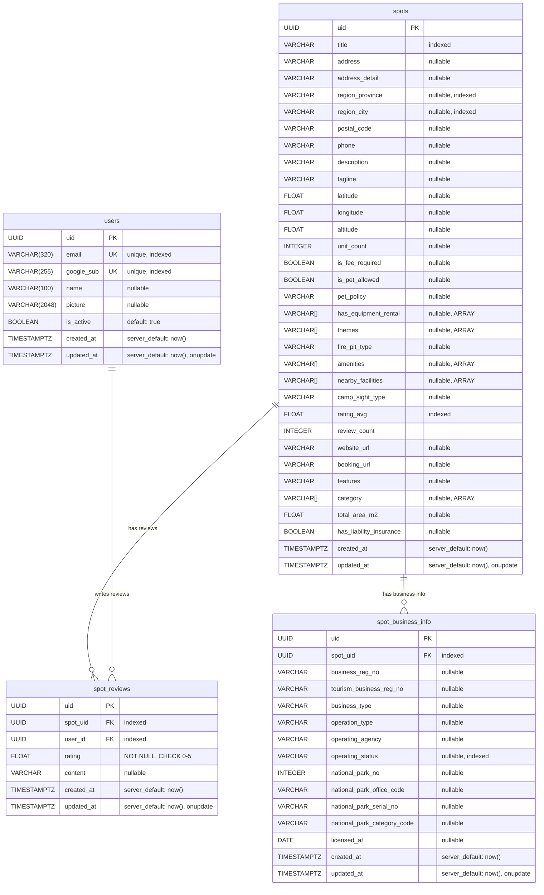

# VIVAC API - Database ERD

> Entity Relationship Diagram (Mermaid)
>
> GitHub, VS Code(Markdown Preview Mermaid 확장) 등에서 시각적으로 렌더링됩니다.

## ERD

## Relationships

| 관계 | 설명 | FK | 제약 조건 |
|------|------|----|-----------|
| `spots` → `spot_business_info` | 1:N | `spot_business_info.spot_uid` → `spots.uid` | - |
| `spots` → `spot_reviews` | 1:N | `spot_reviews.spot_uid` → `spots.uid` | - |
| `users` → `spot_reviews` | 1:N | `spot_reviews.user_id` → `users.uid` | `UNIQUE(spot_uid, user_id)` - 유저당 스팟별 리뷰 1개 |

## Constraints

| 테이블 | 이름 | 타입 | 설명 |
|--------|------|------|------|
| `spot_reviews` | `uq_spot_user_review` | UNIQUE | `(spot_uid, user_id)` - 동일 유저가 같은 스팟에 중복 리뷰 불가 |
| `spot_reviews` | `check_review_rating_range` | CHECK | `rating >= 0 AND rating <= 5` |

## Indexes

| 테이블 | 컬럼 | 용도 |
|--------|------|------|
| `users` | `email` | 이메일 조회 |
| `users` | `google_sub` | Google 로그인 시 사용자 매칭 |
| `spots` | `title` | 스팟 이름 검색 |
| `spots` | `region_province` | 지역(도/광역시) 필터 |
| `spots` | `region_city` | 지역(시/군/구) 필터 |
| `spots` | `rating_avg` | 평점 정렬 |
| `spot_business_info` | `spot_uid` | 스팟별 사업자 정보 조회 |
| `spot_business_info` | `operating_status` | 운영 상태 필터 |
| `spot_reviews` | `spot_uid` | 스팟별 리뷰 조회 |
| `spot_reviews` | `user_id` | 유저별 리뷰 조회 |
